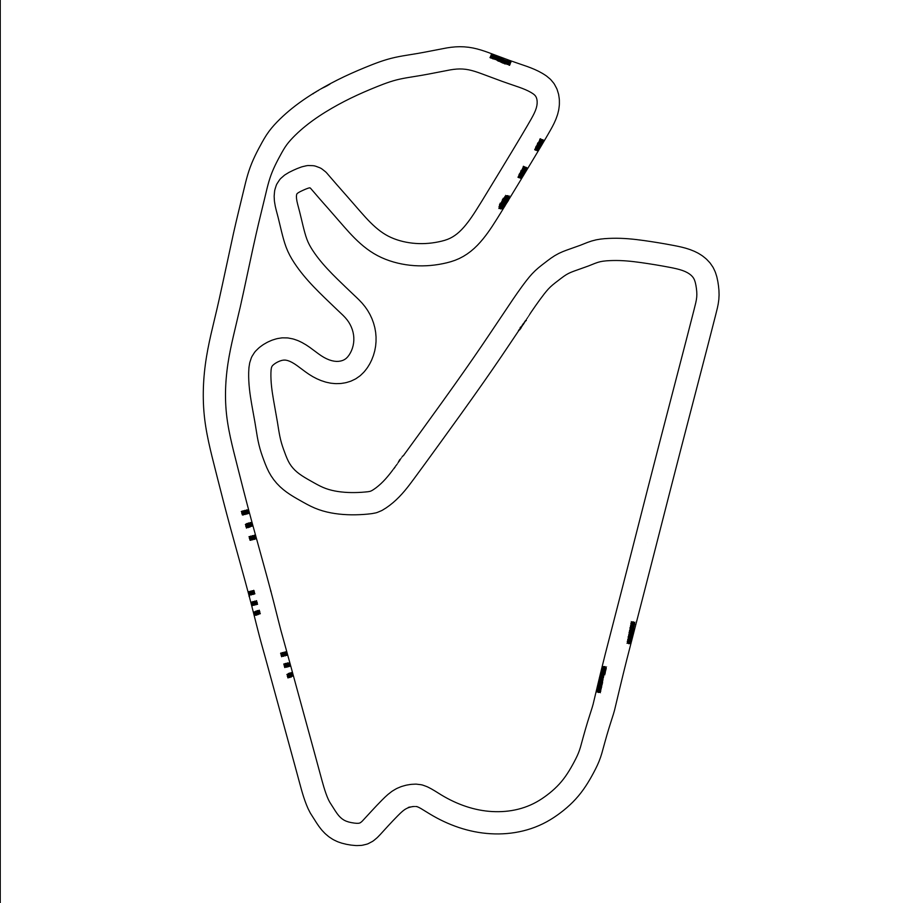

# Follow the Gap — Controlador Reactivo F1TENTH

Tutorial e implementación de dos controladores de navegación reactiva **Follow the Gap (FTG)** para el simulador [F1TENTH Gym](https://github.com/f1tenth/f1tenth_gym_ros) sobre **ROS 2 Humble**:

- **Parte 1 — FTG Normal:** el vehículo recorre el circuito de forma autónoma usando **únicamente** el LIDAR — sin mapa, sin planificación global y sin memoria entre lecturas.
- **Parte 2 — FTG con Obstáculos Estáticos y Dinámicos:** el mismo enfoque reactivo, esquivando obstáculos fijos agregados al mapa y **rebasando** a un vehículo oponente en movimiento.

> **Autor:** Héctor La Mota · ESPOL

---

## 🎥 Demostración

### Parte 1 — FTG Normal

▶️ **[Ver video de la demostración](videos/FTG.webm)** (`videos/FTG.webm`)

### Parte 2 — FTG con Obstáculos Estáticos y Dinámicos

▶️ **[Ver video de la demostración](PEGA_AQUI_EL_LINK_DE_YOUTUBE)** (acelerado 3x–4x; duración real ≈ 12 min)

<!-- GitHub reproduce el .webm al abrir el enlace. Para incrustarlo con reproductor
     dentro del README, arrastra el archivo a la edición del README en la web de GitHub. -->

---

## Tabla de contenidos

1. [¿Qué es Follow the Gap?](#1-qué-es-follow-the-gap)
2. [Parte 1 — FTG Normal (`gap_node.py`)](#2-parte-1--ftg-normal-gap_nodepy)
3. [Parte 2 — FTG con Obstáculos Estáticos y Dinámicos (`gap_rebase_node.py`)](#3-parte-2--ftg-con-obstáculos-estáticos-y-dinámicos-gap_rebase_nodepy)
4. [Requisitos](#4-requisitos)
5. [Instrucciones — instalación desde cero](#5-instrucciones--instalación-desde-cero)
6. [Solución de problemas](#6-solución-de-problemas)

---

## 1. ¿Qué es Follow the Gap?

**Follow the Gap** es un algoritmo de **navegación reactiva**: el robot decide su movimiento instante a instante a partir de lo que ve en *ese* momento, sin construir un mapa ni recordar lecturas anteriores.

> En cada lectura del LIDAR, encuentra el **hueco (gap)** de espacio libre más grande frente al carro y apunta hacia su **centro**, evitando el obstáculo más cercano.

**Analogía:** caminas por un pasillo con los ojos vendados, pero puedes estirar los brazos y sentir a qué distancia está la pared en muchas direcciones. En cada paso te giras hacia donde sientas **más espacio abierto**, y caminas más rápido si el camino está despejado. Eso es lo que hace este algoritmo, 50 veces por segundo — y **no distingue** si lo que tiene cerca es una pared o un carro: a ambos los trata como "obstáculo a esquivar".

### Geometría del sensor

El LIDAR del F1TENTH entrega **1080 rayos** cubriendo un FOV de **270°**:

| Índice | Ángulo | Dirección |
|--------|--------|-----------|
| 0 | −2.35 rad (−135°) | derecha |
| 540 | 0 rad (0°) | **frente** |
| 1079 | +2.35 rad (+135°) | izquierda |

Conversión índice → ángulo: `angulo = angle_min + indice * angle_increment` (con `angle_increment ≈ 0.00435 rad`). Convención de manejo: `steering_angle` **positivo = izquierda**, **negativo = derecha**. Límite físico ≈ **±0.4 rad**.

---

## 2. Parte 1 — FTG Normal (`gap_node.py`)

<p align="center">
  
  <br>
  <em>Circuito de São Paulo, sin obstáculos — mapa usado en la Parte 1</em>
</p>

### Cómo funciona

Cada scan (`lidar_callback`) pasa por 6 pasos:

| Paso | Qué hace |
|------|----------|
| 1. Preprocesar | `inf`/`NaN` → 0, recorta a `rango_max`, suaviza con media móvil |
| 2. Punto más cercano | el rayo de menor distancia (`argmin`) — el obstáculo más peligroso |
| 3. Burbuja de seguridad | anula `radio_burbuja` rayos alrededor del punto cercano (el robot tiene ancho, no es un punto) |
| 4. Gap más grande | secuencia continua más larga de rayos "libres" (distancia > `umbral_gap`) |
| 5. Punto objetivo | centro del gap (más estable que el punto más lejano) |
| 6. Dirección + velocidad | ángulo hacia el objetivo; velocidad proporcional al giro (rápido en recta, lento en curva) |

```
   LIDAR /scan → [1] Preprocesar → [Recorte FOV ±85°] → [2] Punto más cercano
        → [3] Burbuja de seguridad → [4] Gap más grande → [5] Punto objetivo
        → [6] steering + velocidad proporcional → /drive
```

### Estructura del código

Todo vive en una sola clase, `ReactiveFollowGap(Node)`, dentro de [`src/gap_node.py`](src/gap_node.py):

| Método | Rol |
|--------|-----|
| `__init__()` | suscripciones, publicador y parámetros |
| `preprocess_lidar()` | Paso 1: limpia y suaviza el scan |
| `find_max_gap()` | Paso 4: secuencia libre continua más larga |
| `find_best_point()` | Paso 5: centro del gap |
| `lidar_callback()` | orquesta los 6 pasos, aplica anti-oscilación y publica |
| `odom_callback()` | cuenta vueltas y mide su tiempo (no interviene en la conducción) |

**Comunicación ROS 2:** suscribe `/scan` (`LaserScan`) y `/ego_racecar/odom` (`Odometry`, solo para el cronómetro); publica `/drive` (`AckermannDriveStamped`).

### Qué incluye esta implementación

- **Recorte de FOV (`fov_recorte`)** — solo procesa el sector frontal (±85°); los rayos hacia atrás no sirven para conducir hacia adelante.
- **Anti-oscilación** — zona muerta (ignora giros menores a `zona_muerta`) + filtro pasa-bajos (`steering = α·nuevo + (1−α)·anterior`) → rectas firmes, giros suaves.
- **Velocidad proporcional** — interpola entre `vel_recta` y `vel_curva` según el giro: `speed = vel_recta − (vel_recta − vel_curva) · (|steering| / 0.41)`.
- **Contador y cronómetro de vueltas** — `odom_callback` detecta cada vuelta y reporta su tiempo: métrica objetiva para comparar configuraciones.

> **Nota:** esta configuración (`rango_max`, `radio_burbuja`, velocidades, anti-oscilación) es la **misma** que usa `gap_rebase_node.py` en la Parte 2 — se adoptó aquí porque, en la práctica, dio mejor control incluso sin obstáculos. Ver [sección 3](#3-parte-2--ftg-con-obstáculos-estáticos-y-dinámicos-gap_rebase_nodepy) para el detalle de por qué funciona mejor.

### Parámetros clave

| Parámetro | Valor | Qué controla |
|-----------|-------|---------------|
| `rango_max` | 6.8 m | horizonte de visión para buscar gaps |
| `radio_burbuja` | 52 | qué tan lejos se aleja de un obstáculo cercano |
| `umbral_gap` | 1.7 m | qué tan exigente es para considerar un hueco "libre" |
| `fov_recorte` | 85° | ángulo del sector frontal que analiza |
| `vel_recta` / `vel_curva` | 7.0 / 1.30 m/s | rango de la velocidad proporcional |
| `zona_muerta` | 1.5° | umbral mínimo de giro real (anti-zigzag) |
| `alpha_suavizado` | 0.50 | qué tan brusco o suave reacciona la dirección |

Guía completa de tuning (efectos de subir/bajar cada valor, relaciones entre parámetros): [`guia_parametros.md`](guia_parametros.md).

---

## 3. Parte 2 — FTG con Obstáculos Estáticos y Dinámicos (`gap_rebase_node.py`)

<p align="center">
  
  <br>
  <em>Mismo circuito, con obstáculos agregados y un vehículo oponente — mapa usado en la Parte 2</em>
</p>

Mismo pipeline reactivo de la Parte 1 (preprocesar → punto cercano → burbuja → gap → objetivo), reajustado para **evitar obstáculos estáticos del mapa y rebasar a un rival en movimiento**, tratando a ambos exactamente igual: la burbuja de seguridad "engorda" cualquier cosa cercana, sea pared o carro.

### Qué cambia respecto a la Parte 1

`gap_node.py` y `gap_rebase_node.py` comparten hoy **la misma config de navegación** (`rango_max=6.8`, `radio_burbuja=52`, `umbral_gap=1.7`, `fov_recorte=85°`, `zona_muerta=1.5°`, `alpha_suavizado=0.50`) — el tuning que se afinó para esquivar obstáculos y rebasar resultó dar mejor control en general, así que se adoptó también en la Parte 1. La única diferencia real que queda:

| Aspecto | Parte 1 (`gap_node`) | Parte 2 (`gap_rebase_node`) |
|---------|------------------------|-------------------------------|
| `vel_recta` / `vel_curva` | fijos en el código (7.0 / 1.30) | **parámetros ROS** (mismos valores por defecto) — permite lanzar el mismo nodo dos veces con velocidades distintas (ego rápido / oponente lento) |
| Frenado por proximidad/TTC | no tiene | tampoco tiene |

**La clave del rebase no es el tuning, es lo que NO tiene:** la velocidad depende **solo del ángulo de giro** — no hay ninguna capa que frene por estar cerca de algo. Cuando el rival aparece al frente, la dirección (FTG) ya apunta al hueco libre a su lado; como nada frena al carro por la cercanía, la velocidad se mantiene alta y el carro **fluye alrededor del rival y lo pasa**, en vez de quedarse pegado a su ritmo.

### Qué incluye esta implementación

- El mismo pipeline FTG de 6 pasos (preprocesar → punto cercano → burbuja → gap → objetivo → dirección/velocidad).
- Anti-oscilación (zona muerta + filtro pasa-bajos), igual que la Parte 1.
- Velocidad proporcional al giro (`vel_recta` ↔ `vel_curva`), como único control de velocidad.
- Cronómetro de vueltas (`odom_callback`), igual que la Parte 1.
- `vel_recta`/`vel_curva` como **parámetros ROS** — permite lanzar el mismo nodo dos veces (ego rápido / oponente lento) sin duplicar código, ver [Paso 5](#paso-5--parte-2-correr-ftg-con-obstáculos).

### Parámetros clave

| Parámetro | Valor por defecto | Qué controla |
|-----------|--------------------|---------------|
| `rango_max` | 6.8 m | horizonte de visión |
| `radio_burbuja` | 52 | qué tan lejos se aleja de un obstáculo/rival |
| `umbral_gap` | 1.7 m | exigencia para considerar un hueco "libre" |
| `fov_recorte` | 85° | ángulo del sector frontal que analiza |
| `vel_recta` / `vel_curva` | 7.0 / 1.30 m/s (parámetros ROS) | rango de la velocidad proporcional |
| `zona_muerta` | 1.5° | umbral mínimo de giro real |
| `alpha_suavizado` | 0.50 | qué tan brusco o suave reacciona la dirección |

Guía completa de tuning para esta parte: [`guia_parametros.md` → sección Parte 2](guia_parametros.md#8-parte-2--gap_rebase_nodepy).

---

## 4. Requisitos

- **Ubuntu 22.04**
- **ROS 2 Humble**
- **Simulador F1TENTH Gym + ROS bridge:** [`f1tenth_gym_ros`](https://github.com/widegonz/F1Tenth-Repository)
- Dependencias Python: `numpy`, `rclpy`, `ackermann_msgs`

---

## 5. Instrucciones — instalación desde cero

Esta guía asume que partes de una **máquina limpia**, sin nada instalado.

### Paso 0 — Ubuntu 22.04 + ROS 2 Humble

Sigue la guía completa: **[widegonz/Ubuntu-Installation](https://github.com/widegonz/Ubuntu-Installation)**.

### Paso 1 — Instalar el simulador F1TENTH

El workspace base (con el paquete `controllers` y el bridge ROS ↔ simulador) está en **[widegonz/F1Tenth-Repository](https://github.com/widegonz/F1Tenth-Repository)** — ahí está la guía completa con video. Resumen de comandos:

```bash
# F1TENTH Gym (motor de física)
git clone https://github.com/f1tenth/f1tenth_gym
sudo apt install python3-pip
cd f1tenth_gym && pip3 install -e .

# Workspace del simulador
cd $HOME
git clone https://github.com/widegonz/F1Tenth-Repository.git
cd F1Tenth-Repository

# Dependencias ROS
sudo apt install python3-rosdep2
rosdep update
source /opt/ros/humble/setup.bash
rosdep install -i --from-path src --rosdistro humble -y

# Compilar
colcon build
source install/setup.bash
```

> En `src/f1tenth_gym_ros/config/sim.yaml`, revisa que `map_path` use tu usuario real (reemplaza `your_user` por el que definiste en tu máquina).

Verifica que el simulador levanta:

```bash
ros2 launch f1tenth_gym_ros gym_bridge_launch.py
```

Debería abrirse RViz con el carro sobre el mapa por defecto.

### Paso 2 — Copiar los mapas de este tutorial

```bash
cp maps/SaoPaulo_map.*     ~/F1Tenth-Repository/src/f1tenth_gym_ros/maps/
cp maps/SaoPaulo_map_obs.* ~/F1Tenth-Repository/src/f1tenth_gym_ros/maps/
```

### Paso 3 — Copiar los nodos de este tutorial

```bash
cp src/gap_node.py        ~/F1Tenth-Repository/src/controllers/controllers/
cp src/gap_rebase_node.py ~/F1Tenth-Repository/src/controllers/controllers/
```

En `~/F1Tenth-Repository/src/controllers/setup.py`, dentro de `entry_points → console_scripts`, agrega:

```python
'gap_node = controllers.gap_node:main',
'gap_rebase_node = controllers.gap_rebase_node:main',
```

Compila:

```bash
cd ~/F1Tenth-Repository
colcon build
source install/setup.bash
```

### Paso 4 — Parte 1: correr FTG Normal

En `sim.yaml`, configura el mapa sin obstáculos y **1 solo vehículo**:

```yaml
map_path: '/home/TU_USUARIO/F1Tenth-Repository/src/f1tenth_gym_ros/maps/SaoPaulo_map'
num_agent: 1
sx: 0.0
sy: 0.0
stheta: -1.35
```

`colcon build` de nuevo tras el cambio, y lanza (2 terminales):

```bash
# Terminal 1 — simulador
cd ~/F1Tenth-Repository && source install/setup.bash
ros2 launch f1tenth_gym_ros gym_bridge_launch.py

# Terminal 2 — controlador
cd ~/F1Tenth-Repository && source install/setup.bash
ros2 run controllers gap_node
```

El carro empieza a dar vueltas solo, y la terminal del controlador muestra el log de cada vuelta:

```
[INFO] Cronómetro iniciado — esperando primera vuelta...
[INFO] VUELTA 1 completada — tiempo: 24.83 s
```

### Paso 5 — Parte 2: correr FTG con Obstáculos

En `sim.yaml`, cambia al mapa con obstáculos y **2 vehículos**:

```yaml
map_path: '/home/TU_USUARIO/F1Tenth-Repository/src/f1tenth_gym_ros/maps/SaoPaulo_map_obs'
num_agent: 2
sx: 0.0
sy: 0.0
stheta: -1.35
sx1: 36.0
sy1: -16.0
stheta1: 1.40
```

`colcon build` de nuevo, y lanza (**3 terminales** — el simulador necesita mensajes simultáneos en `/drive` y `/opp_drive`; si solo publicas en uno, **ninguno** de los dos vehículos se mueve):

```bash
# Terminal 1 — simulador
cd ~/F1Tenth-Repository && source install/setup.bash
ros2 launch f1tenth_gym_ros gym_bridge_launch.py

# Terminal 2 — ego (rápido)
cd ~/F1Tenth-Repository && source install/setup.bash
ros2 run controllers gap_rebase_node

# Terminal 3 — oponente (lento, mismo nodo con otros parámetros)
cd ~/F1Tenth-Repository && source install/setup.bash
ros2 run controllers gap_rebase_node --ros-args \
  -r __node:=opp -r /scan:=/opp_scan -r /drive:=/opp_drive \
  -r /ego_racecar/odom:=/opp_racecar/odom \
  -p vel_recta:=2.0 -p vel_curva:=1.0
```

El ego debería esquivar los obstáculos del mapa, alcanzar al oponente y **rebasarlo** apuntando al hueco libre a su lado.

> Cada vez que edites un nodo: `colcon build && source install/setup.bash` antes de volver a correrlo.

---

## 6. Solución de problemas

| Síntoma | Causa probable | Solución |
|---------|----------------|----------|
| El carro no se mueve | No sourceaste la terminal, o el nodo no publica en `/drive` | `source install/setup.bash` en **cada** terminal; verifica con `ros2 topic echo /drive` |
| Con 2 vehículos, ninguno se mueve | Solo hay mensajes en `/drive` **o** `/opp_drive`, no en ambos | Lanza el ego y el oponente juntos (Terminal 2 y 3 del Paso 5) |
| `Package 'controllers' not found` | Olvidaste compilar o registrar el nodo | `colcon build` y revisa el `entry_point` en `setup.py` |
| El carro choca en las curvas | Va muy rápido para lo que reacciona | Baja `vel_curva`, o sube `radio_burbuja` y `alpha_suavizado` |
| El carro serpentea en las rectas | Reacciona a giros minúsculos por ruido | Sube `zona_muerta` y/o baja `alpha_suavizado` |
| El ego no rebasa al rival (Parte 2) | El oponente va casi tan rápido como el ego | Baja `vel_recta`/`vel_curva` del oponente (Terminal 3) |
| Los cambios no tienen efecto | Corriste el nodo sin recompilar | `colcon build && source install/setup.bash` antes de `ros2 run` |

> Los detalles de cada parámetro están en la [guía de tuning](guia_parametros.md).
